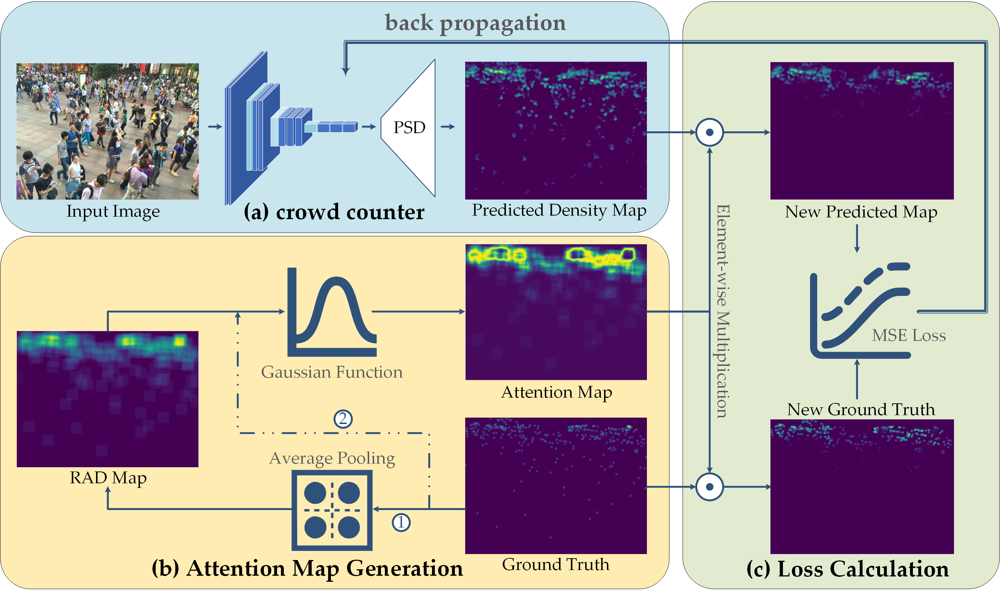

# DCL-CrowdCounting

This is an official implementaion of the paper "Density-aware Curriculum Learning for Crowd Counting", completed in February 2018, accepted by T-CYB in Oct 2020.




This repository shows how PSCC is trained with/without DCL strategy. Relevant experiment processes are shown in process_reports.

- `normal.log` demonstrates the process of PSCC under random sampling.
- `curriculum.log` demonstrates the process of PSCC under density-aware curriculum learning.
- `*.txt` shows the configration and verification results during training.

# Requirements

- Python 2.7 (It is 2019 when submiting the paper. `py3` will be support in the future.)
- Pytorch 1.2.0
- TensorboardX
- torchvision 0.4.0
- easydict

# Dara preparation

1. Download the original ShanghaiTech Dataset [link: [Dropbox](https://www.dropbox.com/s/fipgjqxl7uj8hd5/ShanghaiTech.zip?dl=0) / [BaiduPan](https://pan.baidu.com/s/1nuAYslz)]
2. generate the density maps using the `generate_data.py` in datasets (using **Python 3** beachse of the *f-string*) according to the README in datasets.
3. modify the `dataset/SHHA/setting.py` th specify the path of dataset.

# Training

1. modify the training parameters in `config.py`.
    - Without DCL, set `__C.DCL_CONF['work'] = False`
    - With DCL, set `__C.DCL_CONF['work'] = True`
2. `python train.py`, using `CUDA_VISIBLE_DEVICES=0[,1,2,3]` to specify the GPU id.

# Citation

If you use the code, please cite the following paper:

```
@article{wang2020Density,
  title={Density-aware Curriculum Learning for Crowd Counting},
  author={ Wang, Qi  and  Lin, Wei  and  Junyu, Gao and Xuelong, Li },
  journal={IEEE Transactions on Cybernetics},
  year={2020},
}
```
